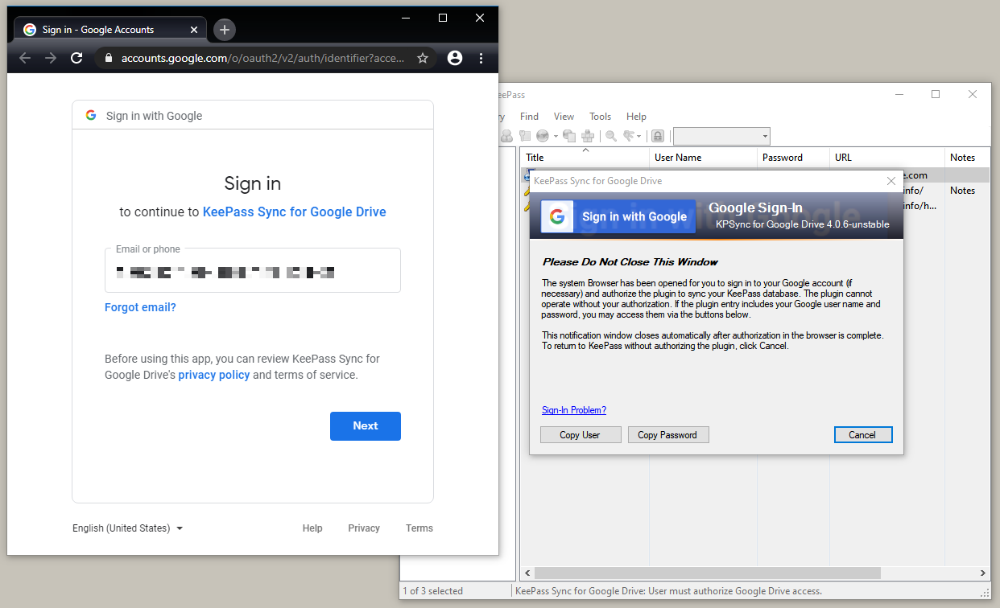
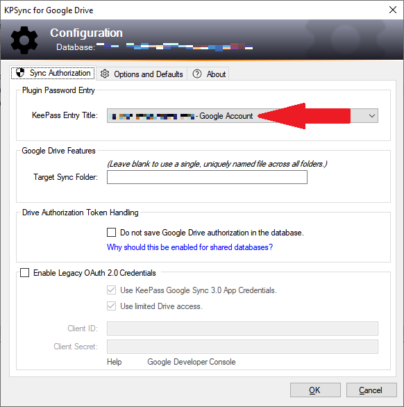

# KeePass Sync for Google Drive™
(formerly [*KeePass Google Sync*](https://sourceforge.net/projects/kp-googlesync/))

(Note: This README is a bare-bones primer and may be outdated in terms of
features and bugfixes. You should visit https://www.kpsync.org for the latest
information and documentation.)

Beyond simple backup or online storage, the plugin leverages KeePass'
[synchronize function](https://keepass.info/help/v2/sync.html) to maintain
perfect copies of the database in the Google Drive cloud and in Windows storage for
extra security. Changes made to the database elsewhere can be accurately
merged with the local copy of the database. Users of multiple devices and
[mobile or other KeePass-compatible programs](https://keepass.info/download.html)
that synchronize with Google Drive will find this plugin quite useful.

* [Requirements](#requirements)
* [Compatibility](#compatibility)
* [Installation (Normal)](#installation-normal)
* [Installation (Portable)](#installation-portable)
* [Primary Functions](#primary-functions)
* [Secondary Functions](#secondary-functions)
* [Synchronizing a Database](#synchronizing-a-database)
* [Configuration](#configuration)
* [Privacy and Security](#privacy-and-security)
* [Obtaining Custom OAuth 2.0 Credentials](#obtaining-custom-oauth-20-credentials)

## Primary Functions
The plugin uses the name of the local database file when uploading/downloading
to the local machine.  These primary functions are accessed with KeePass menu
commands (Tools &#x21D2; KeePass Sync for Google Drive): 
* Synchronize: The copy of the database on Google Drive is downloaded to your
local machine, *merged* with the currently open database via the KeePass
"Synchronize with File" feature, then uploaded back to Google Drive, replacing
the remote file.
* Upload: The copy of the current database is uploaded to Google Drive,
_replacing_ the remote file of the same name, if any.
* Download: The remote file on Google Drive is downloaded to the local machine,
_replacing_ the currently open database. The database is not saved to the local
file until you explicitly do so.

## Secondary Functions
These optional functions are accessed automatically or with keyboard commands,
and configured with the plugin's configuration window (Tools &#x21D2; KeePass Sync for Google Drive &#x21D2; Configure):
* Auto-sync: Automates the Synchronize function to run when the database is
saved to, and/or read from the local file via KeePass commands. To use this your
database must be configured to synchronize "manually" via menu commands.
When enabled, this feature can be temporarily suppressed by holding the Shift
key when opening/saving the database file.
* Custom OAuth 2.0 ClientId Credentials: Provide your own credentials, [obtained
from Google](#obtaining-custom-oauth-20-credentials), for the ultimate control
over KeePass-secured access to Google Drive, configured per-database.
* Custom Drive folders: Specify a Google Drive folder to contain the
uploaded copy of the database file.

## Compatibility
This is the 4th generation of the plugin, with updated Google Drive APIs,
modern KeePass functionality, and updated .NET Framework security.  Functional
compatibility with *Google Sync Plugin 3.0* is fully maintained while 
fixing issues with current Google authentication requirements.  

If you currently synchronize successfully with the old plugin, this release
will as well, as long as Google continues to respect the authorization token
granted to the old plugin.  However, if you want to synchronize a new database,
or if Google retires your current token saved in an existing database, this
plugin is probably the best way to continue synchronizing in the customary way.

If you configured custom OAuth 2.0 credentials for your database with the old
plugin, these will continue to work as before.

Though not fully forward-compatible due to new KeePass facilities, the plugin
can be safely installed side-by-side with *Google Sync Plugin 3.0*.

## Requirements
* KeePass version 2.35 or later.
* .NET Framework 4.5 or later.
* A modern Windows OS that can run the above.

## Installation (Normal)
The [general instructions](https://keepass.info/help/v2/plugins.html) for
installing plugins apply.  Download the .PLGX file from the [release page](https://github.com/walterpg/google-drive-sync/releases).
For example, KeePassSyncForDrive-x.x.x.plgx, where 'x.x.x' is the release version. 
There should also be a link to the current release on the repo's [README page](https://github.com/walterpg/google-drive-sync).

1. Copy the .plgx file to the KeePass installation directory, for
example "C:\Program Files (x86)\KeePass Password Safe 2".  You probably need to
be signed on with an account in the [Windows "local Administrators group"](https://docs.microsoft.com/en-us/windows/security/identity-protection/access-control/local-accounts#sec-administrator).
2. Restart KeePass (ensure that KeePass is fully shutdown and not simply
minimized to the task bar or [notification tray](https://docs.microsoft.com/en-us/windows/win32/shell/notification-area)).

When KeePass starts, a small delay occurs to initialize the plugin(s)
that you have installed.  Verify that the plugin is installed by examining the
KeePass Tools menu:

## Installation (Portable)
KeePass supports ["portable"](https://keepass.info/help/v2/setup.html#portable)
installation that allows you to install and run KeePass on removable
media such as USB sticks.  To use the plugin in portable mode, ensure that the
machine meets the [minumum .NET Framework requirements](#requirements).

To install the plugin in this mode, use the ".zip"
file embedded the release download (e.g., KeePassSyncForDrive-4.0.1.zip).

1. Create a folder under the KeePass installation folder named 
"KeePassSync4Drive" (for example, if KeePass.exe is installed in a folder named
"K:\sw\KeePass", create the folder "K:\sw\KeePass\KeePassSync4Drive").
2. Extract the contents of the .zip file into the folder created in step 1.

If you have previously used the "normal" plugin installation on a machine where
you now wish to use the "portable" installation, you should remove the
prior plugin installation first.  With normal installation, KeePass creates a
plugin cache that should also be cleared.  Note that this will prevent the 
plugin from operating in normal, non-portable mode, if KeePass is still
installed that way.

1. Remove the ".plgx" file added to the KeePass directory in Step 1 of the 
[Installation (Normal)] instructions.
2. In KeePass, clear the "Plugin Cache" (Tools &#x21D2; Plugins... &#x21D2;
Clear button).
3. Restart KeePass.

## Privacy and Security
As with Google Sync Plugin 3.0, this release offers flexible options for 
securing Google Drive account access.  You may use the
"built-in" OAuth 2.0 credentials, or [your own personal credentials](#obtaining-custom-oauth-20-credentials),
with the assurance that, from the perspective of KeePass and the
plugin, no personal information is logged, shared, or used
for any purpose other than to read and write the KeePass database to and
from Google Drive.  

When you authorize the plugin to access Google Drive, you implicitly grant
access to a few details of your account, such as your email address.
However, *the plugin in no way exercises this trusted privelege*.  The plugin
doesn't need or want this unnecessary information, however Google unavoidably
grants the extra access.  Of course, if you have trouble trusting the
plugin with your personal information, [you've got the code](https://github.com/walterpg/google-drive-sync),
check it out!

## Synchronizing a Database
Tools &#x21D2; KeePass Sync for Google Drive &#x21D2; Sync with Drive.

The first time you sync a database, the plugin will search for an entry with
its configuration data.  If such an entry is not found, the plugin offers to
create one for you.

If you answer "Yes", or the plugin has already been [configured](#configuration),
the plugin logs on to your Google Drive account.  If this is the first time you
have used the plugin or the saved credentials have changed, you will be
prompted for your Google login, via the system browser.  Note that the
plugin also opens a window that directs your attention to the browser sign-in,
and, if you have configured the KeePass entry with your Google login
credentials, allows you to copy them with standard KeePass clipboard functions
for the browser sign-in.

## Obtaining Custom OAuth 2.0 Credentials
The plugin allows you to authorize Google Drive access with personal OAuth
2.0 credentials that Google creates for *your* use.  There are notable
reasons, of possibly questionable value, for doing this:

* If you don't share the credentials with anyone, then no non-mechanical
third party can use them - they are a secret between you, Google, and the
KeePass program running on your PC.
* Though reasonably protected, and only useful with your expressed permission,
the built-in credentials could be compromised by unintended neglect or
nefarious means, and used to "spoof" the plugin's request for authorization.

Google currently allows any user to [obtain OAuth 2.0 client credentials](https://developers.google.com/identity/protocols/oauth2)
for access to its Drive and other APIs.  The process for doing so is designed
for developer use, and it changes periodically.  But generally it goes like this:

1. Log on to the [Google API Console](https://console.developers.google.com/).
2. Use the "Create a Project" link to create a space for your credentials.  
Name it something and click CREATE.
3. Click the "Credentials" link, then "CREATE CREDENTIALS".  A menu or 
screen appears.  Select "OAuth client ID" or something similar.
4. Click through various forms, including a configuration of the consent screen
that Google will display when you use the credentials.  This will help you
identify the use of the credentials later. 
5. Again, click "Credentials", then "CREATE CREDENTIALS". You may have to
enter yet more info, particularly "Application type", which you should indicate
as "other" or "native" (not "web" or "mobile").  Finally, click CREATE.
6. A screen showing your new credentials (the text named "client ID" and "client
secret") should appear.  Copy the credential somewhere safe (hi there KeePass!).
See the next section for hints about this.

## Configuration
The plugin saves configuration details in the KeePass
database.  You should reserve one KeePass entry for this purpose.  It is highly
recommended to use an entry containing the Google user/password for the
Google Drive account that you will be syncing with.  The plugin recognizes
eligible entries as those with a URL field value containing the
text ``accounts.google.com``.  Ensure that the entry you choose has
such a value in the URL field, as shown.

Now open the KeePass Sync for Google Drive configuration dialog (Tools &#x21D2; 
KeePass Sync for Google Drive &#x21D2; Configuration). The drop-down box at the top of the dialog
will contain all KeePass entries tagged with the URL=``accounts.google.com``
field.  Select one entry in the drop-down list where you want to save the
credentials.

To use custom OAuth 2.0 credentials, un-check "**Use built-in OAuth 2.0
Client ID**", and enter the Client ID and Client Secret in the provided text
boxes.

The "**Use limited Drive access**" check box specifies how much access the plugin
requests from Google Drive.  If un-checked, the plugin requests unrestricted
access to all files and folders (this is the traditional access mode used by
the old plugin).  If checked, the plugin will request limited access: only 
those files which are created by or previously accessed by the plugin can be
accessed in this mode.  This mode may be useful with OAuth 2.0 credentials 
that have been marked as "unverified" by Google, and thus not available for unrestricted
use, such as the legacy plugin's built-in credentials.

Another way to restrict plugin access is to specify a particular target 
folder.  If you specify a folder in the "**Target Sync Folder**" text box, the
plugin will read/write all sync files to this folder. If the folder does not
exist, the plugin will attempt to create it before uploading data. Note that when used with the
"Use limited Drive access" option, the plugin will look for a folder with the
given name *that it has access to*, and if such a folder does not exist, it
will create it.  Thus it is possible that you could end up with two folders
with the same name.

The old plugin's readme.txt file is available [here](3.0.Readme.txt).

