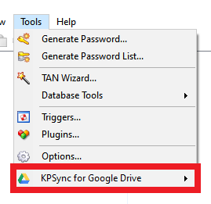

* [First-time Installation](#installation-steps)
* [Upgrade](#upgrading)
* [Troubleshooting](#troubleshooting)

Normal installation is recommended to those who like to run KeePass like any
other Windows program on their computer, and is highly recommended when KeePass
has been [installed with the KeePass installer](https://keepass.info/help/v2/setup.html#installer).

Alternatively, some may prefer the ["portable" installation method](portable).

---

#### First-time Installation Steps
Note that these instructions are only for new installations of the plugin.  If you already have a working installation of the plugin, and wish to replace one version with another version, please follow the instructions in the [Upgrade](#upgrading) section.

Please review the general [KeePass instructions for installing plugins](https://keepass.info/help/v2/plugins.html)
before proceeding.  Also, ensure that all [system requirements](require) are met.

Use the [Download .PLGX button](/) to obtain a file named
KPSyncForDrive-x.x.x.plgx, where 'x.x.x' is the release version.  For
example `KPSyncForDrive-4.1.0.plgx` or `KPSyncForDrive-4.0.6-beta.plgx`.

1. Copy the downloaded .plgx file to the KeePass installation folder, for
example "C:\Program Files\KeePass Password Safe 2".  You probably need to
be signed on with an account in the [Windows "local Administrators group"](https://docs.microsoft.com/en-us/windows/security/identity-protection/access-control/local-accounts#sec-administrator).
Otherwise Windows may prevent the copy with "Access Denied" or similar messages.
2. Restart KeePass.  Please ensure that KeePass is fully shut down and not simply
minimized to the task bar or [notification tray](https://docs.microsoft.com/en-us/windows/win32/shell/notification-area) before restarting.

When KeePass starts, a short delay may occur to initialize new plugin(s)
you have installed.  Verify that the plugin is installed by examining the
KeePass Tools menu:

{:refdef: style="text-align: center;"}

{: refdef}

To ensure you have the most current version of the plugin, click
**Check for Updates** on the KeePass Help menu:

{:refdef: style="text-align: center;"}

{: refdef}

----

#### Upgrading
To install a new version of the plugin to replace a prior version installed in the normal-style, follow these steps.

Use the [Download .PLGX](/) button to obtain the latest release' .PLGX archive.

1. Delete the old version's .plgx file from the KeePass installation folder, for example "C:\Program Files\KeePass Password Safe 2".
    

        Search carefully for files named "KPSyncForDrive*.plgx" (note: '*' in this name is a "wildcard" denoting "any text" between "KPSyncForDrive" and ".plgx", e.g., "KPSyncForDrive-5.0.plgx"). You must remove all such files from the KeePass folder and any of its subfolders for the upgrade to succeed.
    

    

        You probably need to be signed on with an account in the <a href="https://docs.microsoft.com/en-us/windows/security/identity-protection/access-control/local-accounts#sec-administrator">Windows "local Administrators group"</a>. Otherwise Windows may prevent the deletion with "Access Denied" or similar messages.
    

2. Copy the newly downloaded .plgx file to the KeePass installation folder.
3. Restart KeePass.  Ensure that KeePass is fully shut down and not simply
minimized to the task bar or [notification tray](https://docs.microsoft.com/en-us/windows/win32/shell/notification-area) before restarting.
4. Verify the installation of the new version in the **Check For Updates**
window shown above.  If the version shown is not as expected, retrace the steps above and/or the [Troubleshooting](#troubleshooting) section.

----

#### Troubleshooting

KeePass maintains a [cache](https://keepass.info/help/v2/plugins.html#cache) of installed plugins to improve start up performance.  It also has a mechanism for detecting changes, so that only the .PLGX files in the installation folder when KeePass starts are cached (if necessary) and loaded as plugins.  Though usually this works well, it is not entirely foolproof.  

If, after installing a new version of a KeePass plugin, you notice that the plugin release version has not changed, or some other anomaly, you can try deleting the cache using the KeePass Plugins maintenance dialog: **Tools** ⇒ **Plugins...**.  Under **Plugin Cache**, click the **Clear** button, then restart KeePass.  

When KeePass rebuilds the plugin cache, restarting may take a few seconds longer, especially if you have many plugins.

With each plugin [release](https://github.com/walterpg/google-drive-sync/releases), notes are posted in the project's source code repository regarding the updates and issues known both before and after the release.  There may be information available there that is not yet posted here, or is otherwise unavailable.  Please consult this resource if you encounter other problems.