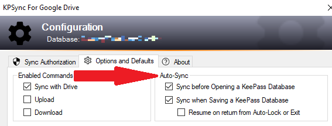

{:refdef: style="text-align: center;"}

{: refdef}

Sync every time you open or save the database.

## What Happens
* If **Auto Sync** is enabled for the KeePass **Open** command, then each time you open a 
database, the **Sync with Drive** function is invoked automatically, thus
ensuring any changes made to the Drive copy since the last time you used the
database are merged into the opened database.
* If enabled for the KeePass **Save** command, any changes made in your current KeePass session are saved *and* merged into the Drive copy.

## How it Works
* Click [**Configuration**](../install/config#configuration-window) on the
plugin menu to open the dialog, then the
[**Options and Defaults** tab](../install/config#options-and-defaults)
shown above.
* The **Sync with Drive** command must be enabled.
* You can enable **Auto Sync** for the **Open** command, **Save** command, or both.
* KeePass notifies the plugin when you **Open** or **Save**, and the plugin invokes the **Sync with Drive** command if enabled.
* **Auto Sync** only works if the current database is configured for the plugin,
and if the **Sync with Drive** function is enabled.
* **BEWARE:** KeePass features such as [auto-lock](https://keepass.info/help/base/security.html#seclocking) save changes then immediately close the database, preventing the plugin from automatically syncing.  In such cases, you can optionally defer **Auto Sync** until the database is reopened.  For more details, see [**Deferred Auto Sync**](#deferred-auto-sync) below.

## Deferred Auto Sync
KeePass' [auto-lock](https://keepass.info/help/base/security.html#seclocking) and similar features interfere with the operation of the **Auto Sync** on **Save** option.  To help ensure minimal impact to **Auto Sync** operations, the plugin implements a "deferred sync" option when interference is detected.

Windows offers several built-in login security features, including automatic idle- and other event-based screen locks.  When paired with <em>secure</em> login credentials, these features may be useful alternatives to KeePass' auto-lock.

KP auto-lock automatically closes databases as a security precaution, based on several different configured criteria (for example, when an idle timer elapses).  When there are unsaved changes to the database and auto-lock is engaged, KeePass runs its **Save** command to save the changes. Unfortunately, KeePass immediately closes the database after this implicit **Save** is complete. 

Even when **Auto Sync** on **Save** is enabled, the plugin cannot sync the database before KeePass closes it, especially if the auto-lock is performed as part of another security operation, such as a screen lock. The KeePass "save changes on exit" feature is another source of this problem, since not only is the database closed - the KeePass program is also terminated.

One way to deal with the issue is to enable the **Auto Sync** on **Open** option.  Thus, when the file is opened after auto-lock, the plugin runs a sync operation.  However, the **Auto Sync** on **Open** option applies to *all*  **Open** commands, rather than only those "reopens" following auto-lock operations that implicitly save changes.

Fortunately, there is another alternative: the plugin is able to detect these problematic sequences.  When such events occur, the plugin marks the database, prior to the save, as a reminder that **Auto Sync** was preempted. When the database is subsequently reopened, the plugin can either:
* Notify you of the condition, and at your discretion proceed with the deferred sync, or 
* Automatically perform the deferred sync operation without your intervention.

To have the plugin perform deferred sync ops automatically when the database is reopened, enable the **Resume on return from Auto-Lock** option.  

Note that the <b>Resume on return from Auto-Lock</b> checkbox is only enabled when the <b>Auto Sync</b> on <b>Save</b> option is enabled.

If the resume option is not enabled, the plugin will instead show a message window, allowing you to decide whether or not to perform the deferred sync.

